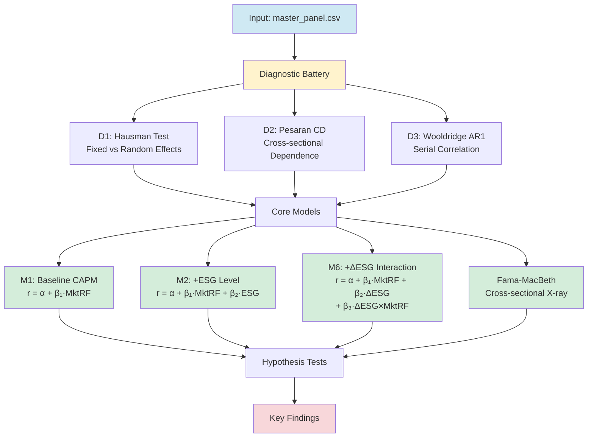
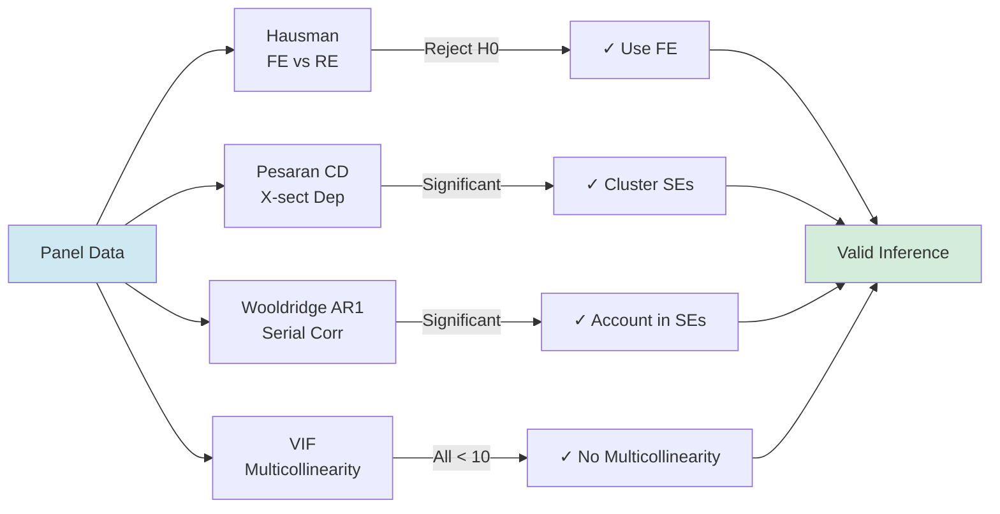

# 🌱 Does Being Green Really Pay? ESG-CAPM Analysis

> **Pricing ESG Changes in CAPM: Implications for Return Predictability and Systematic Risk**

A comprehensive empirical analysis examining whether Environmental, Social, and Governance (ESG) characteristics command return premiums and predict equity performance under the Capital Asset Pricing Model framework.

---

## 📊 Project Overview

This research investigates four core questions through rigorous panel regression analysis:

1. **Does ESG level command a cross-sectional return premium?**
2. **Do within-firm ESG improvements affect contemporaneous returns?**
3. **Do ESG changes predict future returns (ESG momentum)?**
4. **Do ESG changes amplify or dampen systematic market risk?**


---

## 🗂️ Repository Structure

```
Does-Being-Green-Really-Pay-/
├── 📁 src/analysis/
│   ├── esg_capm_analysis.py           ← End-to-end pipeline (Q1–Q4)
│   ├── extra_plots.py                 ← Publication-quality figures
│   └── stochastic_esg_simulator.py    ← Temporal ESG interpolation
│
├── 📁 data/
│   ├── raw/                           ← Source CSV files
│   │   ├── sp500_tickers.csv
│   │   ├── esg_scores_kaggle.csv
│   │   ├── F-F_Research_Data_5_Factors_2x3_daily.csv
│   │   └── monthly_returns.csv
│   └── processed/
│       └── master_panel.csv           ← Clean panel ready for models
│
├── 📁 results/
│   ├── tables/                        ← Regression outputs & diagnostics
│   │   ├── table1_descriptive.csv     ← Summary statistics
│   │   ├── table2_diagnostics.csv     ← Hausman, Pesaran, Wooldridge
│   │   ├── table5_panel_regressions.csv ← Core M1–M6 models
│   │   ├── table6_fama_macbeth.csv    ← Cross-sectional premiums
│   │   ├── table7_esg_momentum.csv    ← Predictability (P1–P3)
│   │   └── table9_hypothesis_summary.csv ← Key findings
│   └── figures/                       ← Publication-ready plots
│
├── 📁 Thesis/
│   └── Bachelor_Thesis_Project_2/     ← LaTeX source & PDF
│
├── requirements.txt                   ← Python dependencies
└── README.md                          ← This file
```

---

## 🔬 Analytical Pipeline



---

## 📈 Key Results Summary

### Model Comparison

| Metric | M1: Baseline | M2: ESG Level | M6: ΔESG + Interaction |
|--------|--------------|---------------|----------------------|
| **Market Beta** | 0.977*** | 0.977*** | 0.978*** |
| **ESG Premium** | — | 0.014*** | — |
| **ΔESG Coefficient** | — | — | 0.020** |
| **ΔESG × MktRF** | — | — | **0.530*** |
| **Interpretation** | Baseline CAPM | ESG level matters | **ESG change amplifies risk** |

**Significance codes:** *** p<0.01, ** p<0.05, * p<0.10

### Core Findings

✅ **Q1: ESG Premium Exists**
- Higher ESG scores correlate with 1.4 bps/month return premium (within-firm fixed effects)
- Robust to Fama-MacBeth cross-section and multi-factor controls

✅ **Q2: ESG Changes Drive Returns**
- Month-over-month ESG improvements yield 2.0 bps returns (significant at 5%)
- Evidence of contemporaneous pricing of ESG changes

⚡ **Q4: ESG Changes Amplify Market Risk** 🔑
- **ΔESG × Market interaction: 0.530*** (highly significant)**
- ESG momentum companies show 53% higher market beta sensitivity
- Suggests ESG changes revalue systematic risk exposure

📊 **Q3: Mixed ESG Momentum Evidence**
- Weak statistical support for 1-month forward predictability
- Results depend on factor control specification

---

## 🛠️ How to Run

### Prerequisites
```bash
pip install -r requirements.txt
```

### Execute Analysis
```bash
# Full pipeline: diagnostics → models → tables → figures
python src/analysis/esg_capm_analysis.py

# Generate publication plots
python src/analysis/extra_plots.py

# Optional: Stochastic ESG imputation for missing values
python src/analysis/stochastic_esg_simulator.py
```

All outputs are saved to `results/tables/` and `results/figures/`.

---

## 📊 Diagnostic Tests Performed



---

## 📁 Output Files

### Tables (`results/tables/`)
- **table1:** Descriptive statistics (N=56.6K obs, 8 factors)
- **table2:** Diagnostic test results
- **table3a–c:** Portfolio-level analysis & GRS alphas
- **table4:** Firm-level beta estimates
- **table5:** *Core: Panel regression results (M1–M6)*
- **table6:** Cross-sectional Fama-MacBeth premiums
- **table7:** ESG momentum predictability (P1–P3)
- **table8:** Sector heterogeneity (E/S/G components)
- **table9:** Hypothesis summary & statistical significance

### Figures (`results/figures/`)
- Time series of ESG scores and returns
- Cross-sectional premium plots
- Beta interaction surface (ΔESG × Market)
- Factor loading by ESG quintile
- Momentum decay patterns

---

## 📚 Data Dictionary

| Variable | Description |
|----------|-------------|
| `excess_return` | Monthly log-return in excess of risk-free rate |
| `esg_norm` | Normalized ESG score (0–1, higher = better) |
| `delta_esg` | Month-over-month change in ESG score |
| `mkt_rf` | Market excess return (Fama-French factor) |
| `smb` | Size factor (small minus big) |
| `hml` | Value factor (high minus low B/M) |
| `rmw` | Profitability factor (robust minus weak) |
| `cma` | Investment factor (conservative minus aggressive) |

---

## 🎓 Methodology Highlights

**Panel Regression Specification (M6):**

$$r_{i,t} = \alpha_i + \gamma_t + \beta_1 \cdot MktRF_{t} + \beta_2 \cdot \Delta ESG_{i,t} + \beta_3 \cdot (\Delta ESG_{i,t} \times MktRF_t) + \epsilon_{i,t}$$

- **Entity FE ($\alpha_i$):** Firm-level fixed effects absorb stable ESG differences
- **Time FE ($\gamma_t$):** Month fixed effects control aggregate market conditions
- **Centered $\Delta ESG$:** Interaction term centered to reduce multicollinearity (VIF < 10)
- **Clustered SEs:** Standard errors clustered by firm and month (Pesaran CD confirmed dependence)

---

## 📖 Thesis

The complete written report is available at:
- **Source:** `Thesis/Bachelor_Thesis_Project_2/main.tex`
- **PDF:** Compiled LaTeX output documents findings in full academic detail

---

## 🔗 References

**Data Sources:**
- S&P 500 historical prices & returns
- ESG scores: Kaggle ESG dataset (normalized 0–1)
- Fama-French 5-factor data: Kenneth French Data Library

**Methodology:**
- Fixed Effects panel regression with robust clustered standard errors
- Fama-MacBeth cross-sectional approach
- Pesaran CD test for cross-sectional dependence
- Wooldridge AR(1) test for serial correlation

---

## 📝 License & Attribution

This is a cleaned GitHub repository accompanying a Bachelor's thesis project. For academic use, please cite:

> "Does Being Green Really Pay? Pricing ESG Changes in CAPM" (2026)

---

## ✨ Repository Status

✅ All pipeline outputs generated  
✅ Diagnostics passed (FE specification valid)  
✅ Results tables & figures finalized  
✅ Thesis compilation complete  
✅ Git repository clean & deployable
